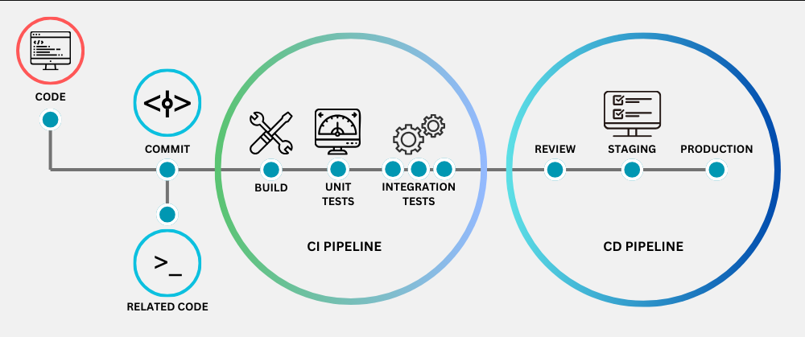

## Web application to upload Excel files and load them into a database

This project aims to create a web page using Streamlit, allowing users to upload an Excel file. The code then validates whether the file conforms to the correct columns, data types, and predefined data. After validation, the data is sent to a PostgreSQL database hosted on Render.

The code was developed with tests using pytest and implemented Continuous Integration and Continuous Delivery (CI/CD) pipelines.

Key features:

- Interactive web page for Excel file upload.
- Automated validation of Excel files.
- Integration with PostgreSQL database.
- Unit and integration testing with pytest.
- Automated deployment using CI/CD.




Continuous Integration (CI) and Continuous Delivery (CD) are essential practices in software development, aimed at delivering flawless systems that meet user needs. CI involves integrating code changes into a shared repository frequently, which is automatically verified through automated tests, reducing the risk of bugs and conflicts. On the other hand, CD extends CI by automatically deploying code changes to a staging or production environment after passing automated tests, ensuring that the software is always ready for production deployment.

CI and CD are applied through multiple stages, each executing different actions to ensure the overall quality of the project:

## CI:

- Environment setup: Define a development environment with CI infrastructure.
- Code versioning: Use version control systems like Git to store and track code changes.
- Creation of automated tests: Develop automated tests to ensure code changes don't negatively impact the system.
- Frequent integration: Integrate code changes into the version control system and initiate continuous integration processes.
- Error notification: Notify developers of compilation errors or test failures.
- Error correction: Developers fix errors promptly to start a new cycle of continuous integration.
- Continuous integration: If tests pass, the code is automatically deployed to a staging or production environment.
## CD:

- Environment setup: Define a deployment environment with CD infrastructure.
- Deployment automation: Automate the deployment process, including environment setup and application configuration.
- Definition of deployment flow: Specify deployment steps for each environment, including staging and production.
- Configuration of environment variables: Define environment variables for each environment, including database access credentials.
- Final testing: Perform final tests in each environment to ensure software readiness for production deployment.
- Continuous deployment: If final tests pass, automatically deploy the code to a production environment.
- Monitoring and feedback: Monitor the production environment for errors or performance issues and provide feedback to developers.
- These steps are repeated continuously throughout the project lifecycle, ensuring that code changes are implemented quickly and securely, even if minor bugs occur.

## Inicial configuration:

1) Let's define our Python version using Pyenv

```bash
python --version
pyenv versions
pyenv local 3.11.5
```

2) Let's set up our virtual environment

```bash
python -m venv nome_do_ambiente_virtual 
# The default is to use .venv

source nome_do_ambiente_virtual/bin/activate
# Linux and macOS users

nome_do_ambiente_virtual\Scripts\Activate
# Windows users
```

3) Replicating environments, if we want to run our project on another machine, it will not be necessary to download dependencies one by one, just do:

```bash
pip install -r requirements.txt
```

4) Run the project
```bash
streamlit run src/app.py
```